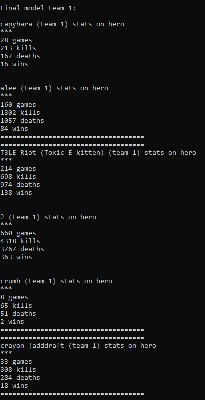
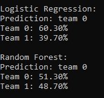

# Deadlock Match Win Probability Predictor

This is my first machine learning project. It tries to predict which team is more likely to win a live Deadlock match by looking at the players, their selected heroes, and their previous performance.

The project started as a way to practice the full ML workflow: collecting data, preparing a dataset, selecting model parameters, training models, and finally using them on a real match.

## Prediction examples





## Models

The project includes two models:

- Logistic Regression
- Random Forest

Both models return a predicted winner and a win probability for each team. The results should be treated as an experiment rather than a guaranteed match outcome.

## Test results

The models were evaluated on the most recent 20% of the dataset, while the earlier 80% was used for training.

| Model | Train accuracy | Test accuracy | Test ROC-AUC |
|---|---:|---:|---:|
| Logistic Regression | 59.54% | 60.75% | 0.6444 |
| Random Forest | 65.88% | 59.79% | 0.6355 |

These results show the performance on the held-out dataset. Live match results will be tracked separately as a small practical experiment.

## Selected model parameters

The hyperparameter search is implemented in `scripts/tune_hyperparameters.py`. The following selected parameters are used for the final models in `scripts/train_models.py`.

### Logistic Regression

```python
LogisticRegression(
    C=0.001,
    penalty="l2",
    solver="saga",
    max_iter=5000,
    random_state=42
)
```

The model is trained inside a pipeline with `StandardScaler`.

### Random Forest

```python
RandomForestClassifier(
    n_estimators=200,
    max_depth=6,
    min_samples_split=20,
    min_samples_leaf=2,
    max_features=0.75,
    criterion="log_loss",
    bootstrap=True,
    random_state=42,
    n_jobs=-1
)
```

## Project structure

- `scripts/predict_match.py` — reads the players from a live match and predicts the result
- `scripts/collect_ids.py` — collects match IDs from player history
- `scripts/collect_match_data.py` — downloads metadata for the collected matches
- `scripts/build_dataset.py` — builds the training dataset from raw match metadata
- `scripts/tune_hyperparameters.py` — explores the dataset and searches for model parameters
- `scripts/train_models.py` — trains, evaluates, and saves the final models
- `data/deadlock_dataset.csv` — processed training dataset
- `saved_models/` — expected location of the trained model files
- `docker/docker-compose.yaml` — local live-events API configuration

The large raw metadata file is not included because it can grow to many gigabytes. A processed dataset is included, so the models can be trained without downloading all raw matches again.

## Requirements

- Python 3.10 or newer
- Docker with Docker Compose

## Installation

Clone the repository and enter its directory:

```bash
git clone https://github.com/peglin-lgtm/deadlock-winrate-predictor.git
cd deadlock-winrate-predictor
```

Create a virtual environment:

```powershell
python -m venv .venv
.venv\Scripts\Activate.ps1
```

Install the Python dependencies:

```powershell
pip install -r requirements.txt
```

## Train the models

The processed dataset is already included. Train the final models with:

```powershell
python scripts/train_models.py
```

This creates:

```text
saved_models/deadlock_logistic_regression.joblib
saved_models/deadlock_random_forest.joblib
```

Hyperparameter search is optional and may take a long time:

```powershell
python scripts/tune_hyperparameters.py
```

## Why Docker is used

The regular Deadlock API provides historical player and match statistics, but the prediction script also needs to know who is currently playing and which heroes they selected.

Docker runs the `deadlock-live-events` service locally on port `3000`. This service reads events from the live match and provides the player and hero information to `scripts/predict_match.py`. The Python script then requests each player's historical statistics, prepares the same features used during training, and passes them to the models.

In short, Docker is only needed for live match prediction. It is not required for dataset exploration, hyperparameter search, or model training.

## Predict a live match

Create the empty environment file expected by the Docker configuration, then start the live-events service:

```powershell
New-Item docker/.env -ItemType File -Force
docker compose -f docker/docker-compose.yaml up -d
```

Open `scripts/predict_match.py` and replace the example `match_id` with the ID of the match you want to predict:

```python
match_id = 93379629
```

Then run:

```powershell
python scripts/predict_match.py
```

The script waits until the local service finds six players on each team. It then loads their historical hero statistics and prints the prediction from both models.

## Rebuild the dataset

You do not need to rebuild the dataset just to try the project. If you want to repeat the entire data collection process, run:

```powershell
python scripts/collect_ids.py
python scripts/collect_match_data.py
python scripts/build_dataset.py
python scripts/train_models.py
```

This process makes many API requests, so it can take a long time. It also creates `data/matches_metadata.jsonl`, which can grow to many gigabytes and is intentionally excluded from Git.

## Data source

Historical match and player statistics are requested from the public Deadlock API. Current match events are read through the local `deadlock-live-events` service.

## Disclaimer

This is an independent educational project. It is not affiliated with or endorsed by Valve Corporation. Deadlock is a trademark of Valve Corporation.
